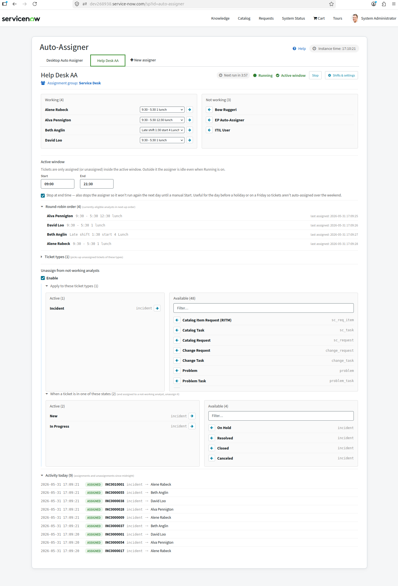

# ServiceNow Auto-Assigner

**Fairly share your team's workload — automatically.**

Auto-Assigner is a scoped **ServiceNow** application that distributes incoming
tickets of every type, **round-robin**, to the analysts who are actually working
right now — based on each analyst's assigned **shift**, and even their **shift
breaks**. If an analyst steps away, it can take their unanswered tickets back and
return them to the queue for someone who's on the clock.

**Built to run entirely inside your ServiceNow instance:**

- **No external API calls and no extra authentication** — everything happens on-platform.
- **Analysts come from your existing assignment groups** — nothing to maintain separately.
- **Ticket types are discovered from your own instance** — Incident, Request, Change, HR, CSM, and any task-based table.
- **Round-robin balancing** spreads the next ticket evenly across available analysts, regardless of backlog size.
- **Shift- and break-aware** — only analysts who are working and currently on shift receive tickets.
- **Optional auto-unassign** pulls tickets back from analysts who aren't working, so nothing sits idle.

---

- **[User Guide](user-guide.md)** — how to set up and run an auto-assigner.
- **[Store Listing](store-listing.md)** — marketing copy for the ServiceNow Store page.
