# Auto-Assigner — User Guide

Auto-Assigner watches an assignment group's queue and hands each new, unassigned
ticket to an available analyst in turn, so work is shared evenly without anyone
having to triage by hand. You decide which ticket types it covers, who's
working, what hours it runs, and when (if ever) it should pull tickets back off
people who have stepped away.

This guide walks through everyday use. For a quick reference of who can do what,
jump to [Roles & access](#roles--access).

---

## Getting started

Open the Auto-Assigner page in the Service Portal (your administrator will give
you the link, typically `/sp?id=auto-assigner`).

Each auto-assigner appears as its own **tab** across the top. Click a tab to see
that assigner; the page opens on the first one.

### Creating an assigner

Click the **+ New assigner** tab, choose an **assignment group**, give it a
**name**, and click **Create**.

A new assigner starts **stopped**, with a 24-hour active window and a default
**09:00–17:00** shift (with a 12:30–13:30 break) already set up, so you can fine
tune everything afterwards.

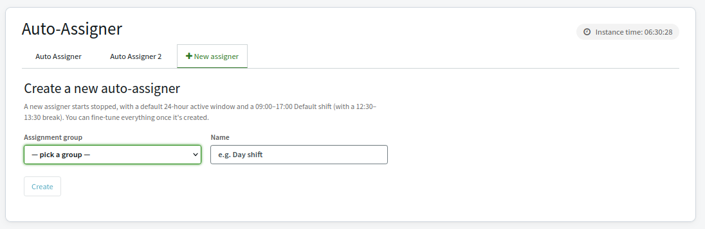

> You can create more than one assigner for the same group — for example a
> day-shift and a night-shift assigner with different working hours.

---

## The roster: who's working

Each assigner shows two lists: **Working** and **Not working**. Everyone in the
assignment group appears in one of them.

- Use the arrow buttons to move an analyst between the two lists.
- For each person in **Working**, pick the **shift** they're on from the
  dropdown. Only people who are working *and* currently on shift (and not on a
  break) receive tickets.

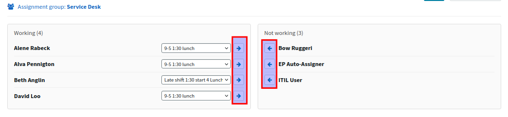

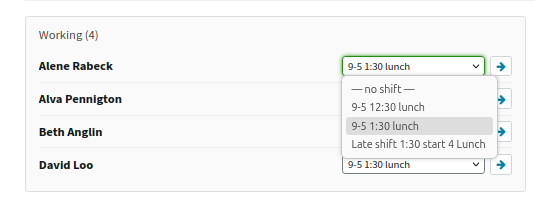

Group membership is kept in sync automatically: add someone to the underlying
assignment group and they show up here; remove them and they drop off.

---

## Starting and stopping

Use the **Start / Stop** button in the header to turn an assigner on or off.
While running, the header shows a live status and a **"Next run in …"** countdown
to the next assignment cycle (the engine runs every few minutes).

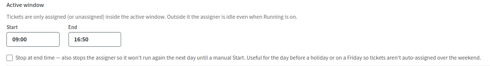

### Active window (working hours)

Under **Shifts & settings → Active window**, set the **Start** and **End** times
of day. Tickets are only assigned (or unassigned) inside that window; outside it
the assigner sits idle even when it's running, and resumes automatically at the
next start time.

- **Stop at end time** — an opt-in checkbox. When ticked, reaching the end time
  also *stops* the assigner so it won't run again until someone presses Start.
  Handy on a Friday or the day before a holiday, so tickets aren't auto-assigned
  over the break.

All times are entered as 24-hour **HH:MM**. Typing four digits fills in the
colon for you (`0930` → `09:30`), `2400` becomes `00:00`, and anything that
isn't a valid time reverts to what was there before.

---

## What gets assigned

### Ticket types

Under **Ticket types**, choose which tables the assigner picks up unassigned
tickets from (Incident, Catalog Task, Change Task, and so on). Move a type to
**Active** to include it; only *unassigned* tickets of the active types, sitting
in this assigner's group, are distributed.

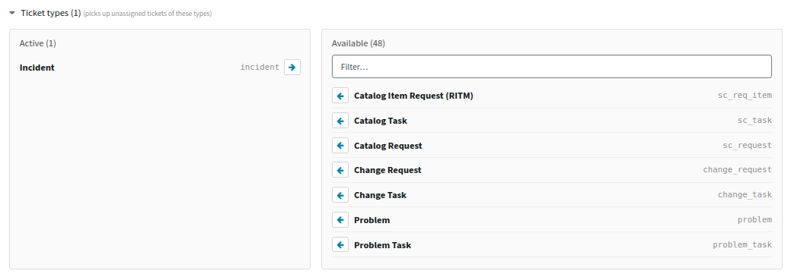

### How the round-robin works

Tickets go to eligible analysts **in turn** — whoever was assigned least recently
goes next. Current workload (how many tickets someone already has) is
deliberately ignored; the goal is even *distribution*, not even *backlog*.

- **Eligible** means: in the Working list, on a shift that's active right now,
  not on a break, and within the assigner's active window.
- When several tickets are distributed at once, the oldest tickets go first.

The **Round-robin order** panel shows the current line-up — who's next and when
each person was last assigned.

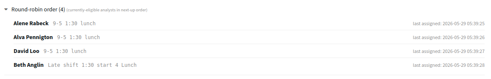

---

## Pulling tickets back (reassign)

Sometimes a ticket gets assigned to someone who then goes off-shift or steps
away before responding. Under **Unassign from not-working analysts** you can have
the assigner take those tickets back so they're picked up again next cycle.

1. Tick **Enable**.
2. Under **Apply to these ticket types**, choose which tables this applies to.
3. Under **When a ticket is in one of these states**, choose the states that
   should trigger a pull-back (for example, still *New*).

A ticket is only unassigned if it's assigned to someone currently **not
working**, on one of the chosen types, in one of the chosen states.

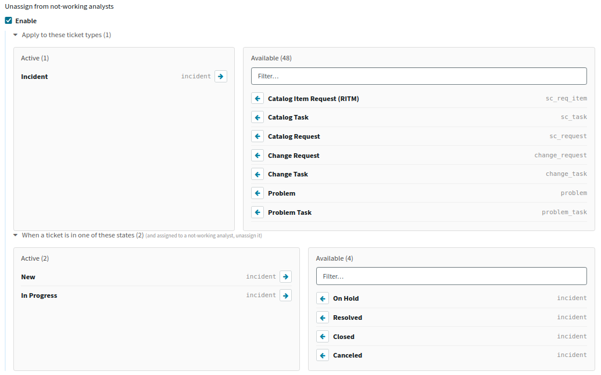

---

## Shifts & breaks

Open **Shifts & settings** (the gear button in the header) to manage shifts.

- Each shift has a **name**, a **start** and **end** time, and zero or more
  **breaks** (each a start–end range).
- There's a built-in **Default** shift you can rename and adjust like any other;
  it can't be deleted, because it's the fallback for newly-working analysts.
- Add a shift with the **Add shift** row; add breaks within a shift with
  **Add break**.

Changes save automatically as you edit — there are no Save buttons. Removing a
shift or break applies immediately.

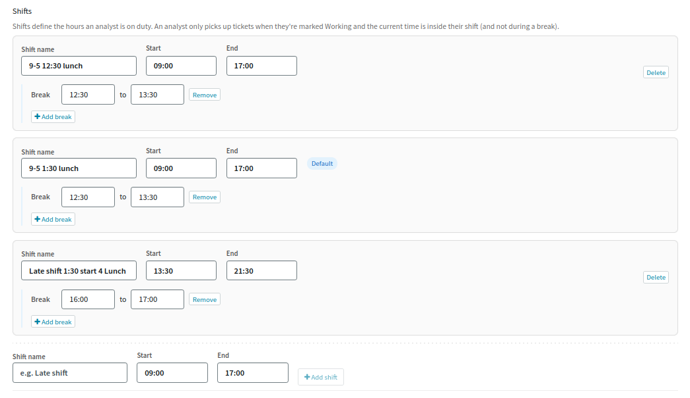

> **Shifts can only be changed while the assigner is stopped.** Press Stop first;
> the editing controls unlock. Deleting a shift that people are on moves those
> analysts to the Default shift.

---

## Personalising a tab

In **Shifts & settings → Tab colour**, pick a pastel colour to tint this
assigner's tab and panel. It's purely visual — handy when you run several
assigners and want to tell them apart at a glance.

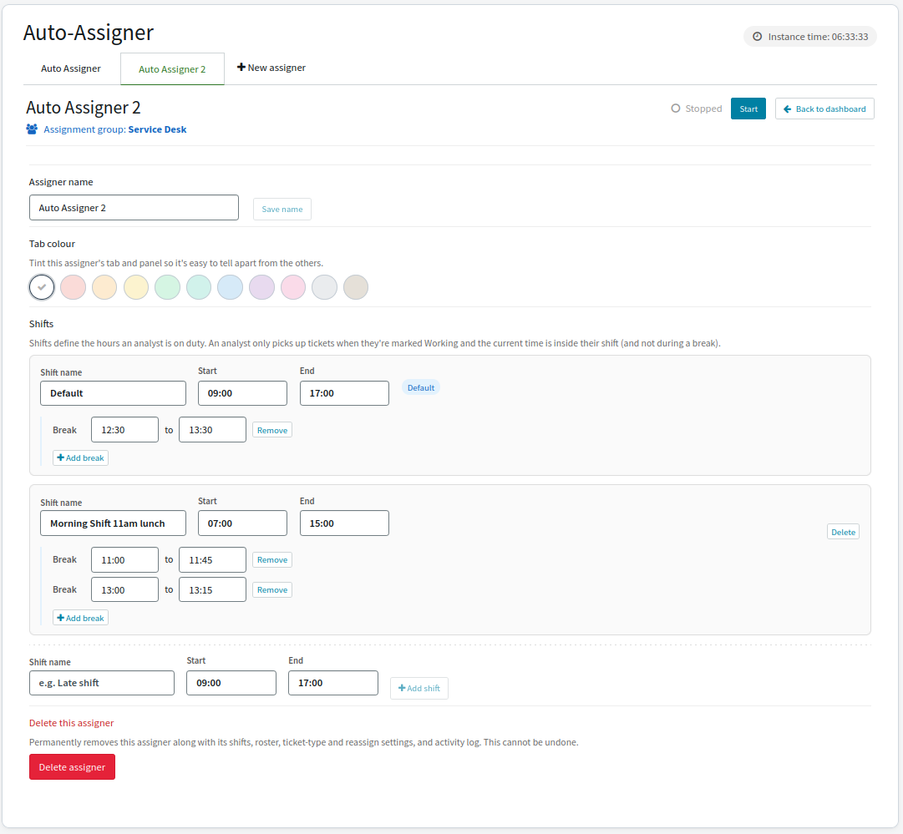

---

## Activity today

The **Activity today** section lists every assignment and unassignment made
since midnight — ticket number, type, the analyst, and the time — newest first.
It's a quick way to confirm the assigner is doing what you expect.

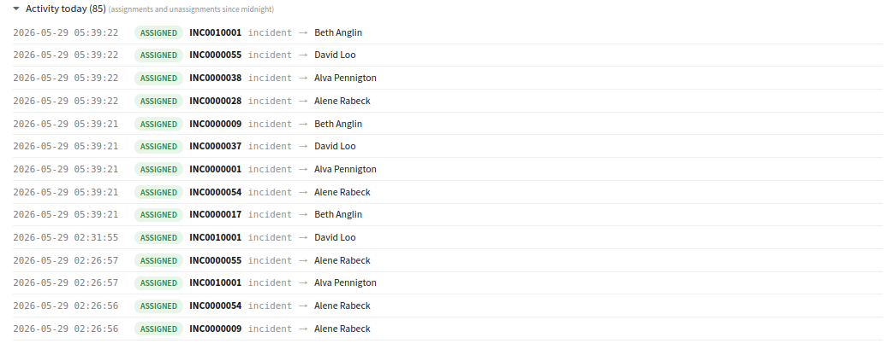

---

## Roles & access

| You are… | What you see |
|---|---|
| **System administrator** | Full control of every assigner on the instance. |
| **Queue manager** *(role `x_1578378_aa.queue_manager`)* **and** a member of the group | Full control of that group's assigner(s): start/stop, settings, shifts, roster, colours, create and delete. |
| **A member of the group** (no manager role) | A read-only view: the assigner tabs, the Working/Not-working roster with each person's shift, and Activity today. |

Two notes on the manager role:

- You need **both** the `x_1578378_aa.queue_manager` role **and** membership of
  the assignment group to manage an assigner.
- Role changes take effect on a **new session** — log out and back in (or restart
  impersonation) after the role is granted, or you'll still see the read-only
  view.

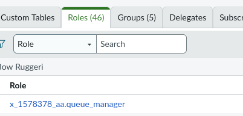

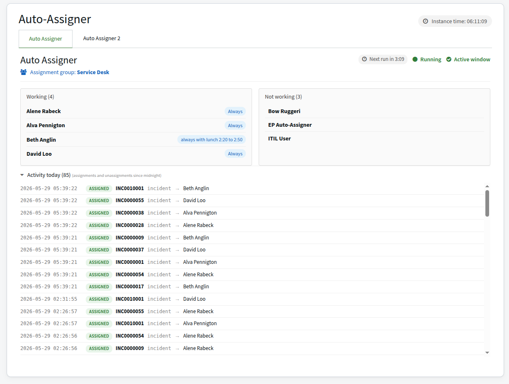
